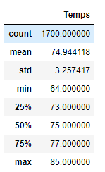

# surfs_up

#Overview: 
* This analysis was done to help find temperature trends. Specifically, temperature data for the months of June and December in Oahu, in order to determine if the surf and ice cream shop business is sustainable year-round.

#Results:
June & December
* You will notice that June is on average warmer than the month of December
* June has a mucher higher "low" temperature than December has

* Lastly June has the higher temperature recorded compared to December

Summary:
* In conclusion this location would work well for a surf and icecream shop because you will not get a lot of different temperatures throughout the year. The averages stay close enough to where you would be able to draw customers all year round without any issue.  It only makes sense that this is the location chosen to open shop!
